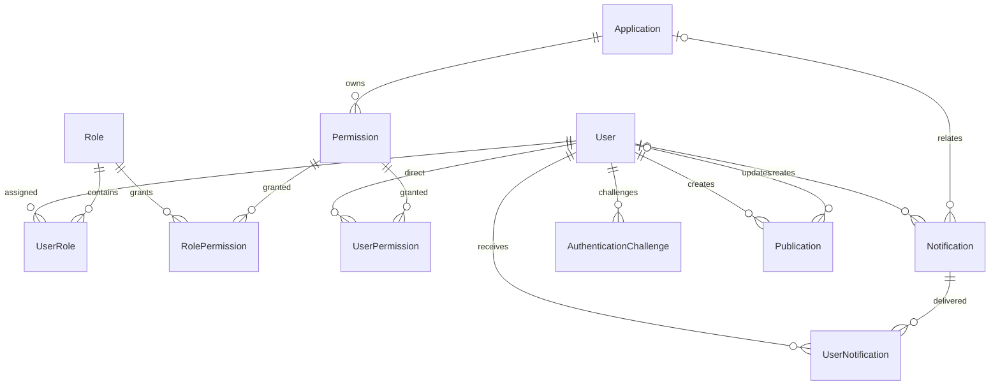

# طراحی و وضعیت بانک اطلاعاتی Portal

تاریخ بررسی و اجرا: 2026-09-17. این سند ادامهٔ `portal-system-understanding.md` و مبتنی بر کد فعلی و اتصال واقعی به SQL Server است. مجوز اجرای تغییرات از درخواست «همه را انجام بده» دریافت شده است. معماری هدفِ کل سکوی سازمانی با قابلیت‌های واقعاً پیاده‌شده یکی نیست؛ موجودیت‌های آینده در انتهای سند جدا شده‌اند.

## نتیجهٔ اجرا

بانک `OrganizationIntranet` اکنون با مدل EF برنامهٔ فعلی تطابق دارد. دو جدول احراز هویت، هفت ستون امنیتی کاربر، کنترل همزمانی انتشار و قیود یکپارچگی لازم اضافه شدند. حذف جدول، حذف داده، تغییر رمز کاربران یا فعال‌سازی LDAP/SMS انجام نشد. تعداد داده‌های کسب‌وکار پیش و پس از migration یکسان بود؛ تنها مقادیر ستون‌های امنیتی جدید و رکورد تنظیمات پیش‌فرض افزوده شدند.

فهرست کامل فیزیکی بانک، شامل همهٔ ستون‌ها، نوع، طول، nullable، identity، default، ترتیب ستون‌های ایندکس، FK، CHECK و آمار تجمیعی در [database-catalog.md](database-catalog.md) قرار دارد. این فهرست خروجی مستقیم [اسکریپت ممیزی](../database/architecture-audit.readonly.sql) است و صرفاً به مدل EF محدود نیست؛ جداول کمکی dbo نیز پوشش داده شده‌اند.

## معماری و مالکیت داده

SQL Server فقط از لایهٔ API و repositoryهای آن استفاده می‌شود. Domain مالک موجودیت‌ها، Application مالک منطق و قرارداد repository، و API مالک EF و اتصال است. Portal و Admin از API استفاده می‌کنند و نباید connection string یا DbContext دریافت کنند. تغییرات قیود احراز هویت در partial مستقل `AppDbContext.AuthenticationIntegrity.cs` قرار گرفته‌اند؛ نگاشت‌های موجود حفظ شده‌اند.

| Schema / جدول | مسئولیت | تعداد رکورد پس از اجرا |
|---|---|---:|
| Sec.User | هویت محلی، وضعیت فعالیت، مشخصات، هش رمز و وضعیت امنیتی | 3 |
| Sec.Role | نقش‌های سازمانی در مدل فعلی | 2 |
| Sec.UserRole | انتساب یکتای کاربر به نقش | 3 |
| App.Application | فهرست سامانه‌های قابل ارائه در پورتال | 1 |
| Sec.Permission | مجوز متعلق به یک سامانه | 6 |
| Sec.RolePermission | انتساب یکتای مجوز به نقش | 6 |
| Sec.UserPermission | زیرساخت انتساب مستقیم؛ وجود جدول به معنی مصرف آن در تمام مسیرهای مجوز نیست | 0 |
| Notify.Notification | رویداد/پیام ارسالی | 0 |
| Notify.UserNotification | گیرنده و وضعیت خواندن هر پیام | 0 |
| Notify.Publication | خبر، اطلاعیه و بخشنامهٔ عمومی پورتال | 0 |
| Sec.AuthenticationSettings | تنظیمات تک‌رکوردی روش‌های ورود | 1 |
| Sec.AuthenticationChallenge | وضعیت چالش کوتاه‌عمر ورود، بازیابی و ثبت عامل دوم | 0 |

`dbo.SchemaMigration` دفتر اجرای migrationهای اصلی و `dbo.sysdiagrams` ابزار SQL Server هستند؛ جزو مدل کسب‌وکار نیستند. در زمان بررسی view، stored procedure و trigger کسب‌وکاری مشاهده نشد؛ اشیای مدیریت diagram جداگانه در catalog ثبت شده‌اند.

## مدل روابط



این نمودار خلاصه است؛ nullable دقیق FKها و نام قیود در catalog مرجع‌اند. `AuthenticationSettings` رابطهٔ FK ندارد؛ `SettingsRevision` در چالش snapshot سیاست امنیتی است و FK به Revision متغیر تنظیمات نیست.

تمام ۱۴ کلید خارجی فعال و trusted هستند و حذف آبشاری ندارند. برای حذف نقش، کاربر یا سامانهٔ دارای وابستگی، سرویس باید سیاست روشن داشته باشد؛ غیرفعال‌سازی موجود حفظ می‌شود. زوج‌های User/Role، Role/Permission، User/Permission و Notification/User یکتا هستند. کد مجوز علاوه بر یکتایی در سامانه، در کل بانک نیز یکتا باقی می‌ماند، چون claims فعلی مجوز را تنها با کد شناسایی می‌کند.

## طراحی احراز هویت

هفت ستون جدید `Sec.User`:

| ستون | نوع و مقدار اولیه | کاربرد |
|---|---|---|
| SecurityStamp | varchar(32)، مقدار تصادفی برای هر رکورد | ابطال نشست پس از تغییر امنیتی |
| AuthenticatorSecret | nvarchar(2000)، NULL | راز رمزگذاری‌شدهٔ عامل دوم |
| LastAuthenticatorStep | bigint، -1 | جلوگیری از بازپخش کد زمانی |
| FailedLoginAttempts | int، 0 | شمارندهٔ شکست ورود |
| LockedUntil | datetime2(7)، NULL | پایان قفل موقت |
| LastSecuritySmsAt | datetime2(7)، NULL | کنترل فاصلهٔ ارسال پیام امنیتی |
| AuthenticationVersion | uniqueidentifier، NEWID() | کنترل همزمانی تغییر وضعیت کاربر |

قید شمارنده‌ها مقدار منفی تلاش و step کمتر از -1 را رد می‌کند. ستون‌های قدیمی، از جمله PasswordHash، حفظ شده‌اند. NationalId و MobileNumber فعلاً optional و بدون unique جدید هستند؛ نبود تکرار در سه کاربر دلیل کافی برای تحمیل یکتایی کسب‌وکاری به کل سازمان نیست.

`AuthenticationSettings` دقیقاً کلید مجاز Id=1 دارد. Json باید JSON معتبر با حداکثر 20000 بایت UTF-16 باشد؛ EF طول 10000 کاراکتر را تعریف می‌کند که در SQL Server به nvarchar(max) نگاشت می‌شود. `ProtectedSmsApiKey` محل کلید محافظت‌شده و `Revision` توکن همزمانی تنظیمات است. رکورد اولیه `{}` از پیش‌فرض‌های امن برنامه استفاده می‌کند؛ ارائه‌دهندهٔ خارجی را فعال نمی‌کند. CHECK ساختار JSON جای اعتبارسنجی معنایی تنظیمات در Application را نمی‌گیرد.

`AuthenticationChallenge` شناسهٔ varchar(64)، FK کاربر، هدف، روش ورود، snapshot مهر امنیتی و revision تنظیمات، زمان انقضا/ارسال، هش کد، راز محافظت‌شده، تلاش‌ها، وضعیت مصرف و Version دارد. Purpose محدود به login/reset/enroll و LoginMethod محدود به password/ldap است. توکن خام و کد خام نباید ذخیره شوند. مصرف همزمان با Version کنترل می‌شود؛ سرویس باید expiration، consumed، stamp و revision را نیز بررسی کند. ایندکس ExpiresAt برای جست‌وجو/پاکسازی منقضی‌ها و (UserId,Purpose) برای دسترسی چالش کاربر وجود دارد.

کلیدهای Data Protection باید پایدار، خارج از مخزن و در محیط چند نمونه‌ای مشترک باشند؛ از دست رفتن آنها می‌تواند رازهای محافظت‌شده را غیرقابل استفاده کند. پشتیبان دیتابیس به تنهایی جای پشتیبان امن key ring را نمی‌گیرد. اتصال واقعی LDAP، ارائه‌دهندهٔ SMS و key ring عملیاتی در این بررسی اثبات نشده است.

## انتشار و اعلان

Publication از Notification جداست: اولی محتوای منتشرشدنی، دومی تحویل پیام به گیرنده است. `Revision bigint` با مقدار اولیهٔ صفر و کنترل همزمانی repository از بازنویسی تغییرات کاربر دیگر جلوگیری می‌کند. Kind تنها News/Announcement/Circular است. IsPublished=1 نیازمند PublishedAt و IsPublished=0 نیازمند NULL بودن آن است.

در UserNotification نیز خوانده‌نشده باید ReadAt=NULL و خوانده‌شده باید ReadAt غیرNULL داشته باشد. انتساب تکراری گیرنده در سطح بانک رد می‌شود. ایندکس (UserId,IsRead,CreatedAt) مسیر صندوق و شمارش خوانده‌نشده را پشتیبانی می‌کند. ایندکس‌های انتشار و FKهای نویسنده/ویرایشگر در catalog آمده‌اند.

## تصمیم‌های فیزیکی و ظرفیت

نسخهٔ مشاهده‌شده SQL Server 15.0.4420.2، compatibility=150 و collation برابر SQL_Latin1_General_CP1_CI_AS است. متن فارسی با nvarchar ذخیره می‌شود؛ تغییر collation یا نرمال‌سازی مخرب دادهٔ قدیمی انجام نشده است. مقایسهٔ نام کاربری در collation فعلی case-insensitive است. تاریخ‌های جدید UTC هستند؛ تاریخ‌های قدیمی بدون مدرک منطقهٔ زمانی تبدیل نمی‌شوند. نوع datetime قدیمی برای سازگاری حفظ و در دادهٔ امنیتی جدید datetime2(7) استفاده شده است.

بانک FULL recovery است، RCSI خاموش و AUTO_CLOSE/AUTO_SHRINK خاموش است. هر فایل داده و log در برداشت بررسی 8MB و رشد ثابت 64MB داشت. تغییر recovery، isolation، collation یا حذف ایندکس صرفاً بر اساس حجم فعلی بسیار کوچک توجیه ندارد. بهبودهای بعدی باید با Query Store/طرح اجرا، نرخ واقعی پیام و شمار کاربران سنجیده شوند؛ load test سازمانی انجام نشده است.

FULL recovery نیازمند سیاست عملیاتی پشتیبان log و پایش رشد است؛ اجرای یک backup در این کار اثبات وجود برنامهٔ زمان‌بندی‌شدهٔ backup نیست. حساب اجرای migration باید از حساب runtime جدا باشد؛ سطح دسترسی واقعی حساب سرویس مستقر با مجوز حساب بررسی یکسان فرض نمی‌شود.

## migration، نسخه‌بندی و بازیابی

ترتیب آماده‌سازی یک محیط دارای schema پایهٔ پروژه:

1. گرفتن backup با `database/backup.sql` و بررسی نتیجه.
2. migration موجود `database/migrations/001_DatabaseConsistency.up.sql` طبق پیش‌نیازهای خودش.
3. ایجاد Publication با `tools/sql/001-publications-up.sql` در صورت نبود آن، طبق اسکریپت موجود.
4. اجرای `database/migrations/002_AuthenticationSchema.up.sql`.
5. اجرای `tools/sql/002-publications-integrity-up.sql`.
6. اجرای `database/architecture-verify.readonly.sql` و آزمون اختیاری live schema.

این مسیر نصب بانک کاملاً خالی نیست؛ migrationها به schema پایهٔ موجود نیاز دارند. از EnsureCreated یا ساخت بانک از روی مدل برای جایگزینی بانک فعلی استفاده نشود. اسکریپت‌های دو حوزه فعلاً شماره‌گذاری مستقل دارند؛ عدد 002 به تنهایی شناسهٔ یکتا نیست و باید مسیر کامل ذکر شود. انتشار از الگوی script موجود استفاده می‌کند و ثبت آن در دفتر اصلی migration ادعا نشده است.

نمونهٔ اجرای امن بدون درج رمز در خط فرمان:

```powershell
./tools/Invoke-DatabaseScript.ps1 -ScriptPath ./database/migrations/002_AuthenticationSchema.up.sql
./tools/Invoke-DatabaseScript.ps1 -ScriptPath ./tools/sql/002-publications-integrity-up.sql
./tools/Invoke-DatabaseScript.ps1 -ScriptPath ./database/architecture-verify.readonly.sql
```

ابزار connection را از environment یا User Secrets می‌خواند؛ fallback به appsettings فقط با سوییچ صریح ابزار انجام می‌شود. migration احراز هویت transaction، XACT_ABORT، timeout و قفل کاربردی دارد، اجرای مجدد را تشخیص می‌دهد و schema نیمه‌ساختهٔ بدون ledger را بی‌صدا بازنویسی نمی‌کند. وجود ledger به تنهایی تضمین نبود drift نیست؛ verify و live schema باید اجرا شوند.

پیش از اجرای واقعی، backup از نوع COPY_ONLY با CHECKSUM گرفته شد و RESTORE VERIFYONLY موفق بود:

`C:\Program Files\Microsoft SQL Server\MSSQL15.MSSQL2019\MSSQL\Backup\OrganizationIntranet_BeforeDatabaseReview_20260917_121422.bak`

VERIFYONLY معادل تمرین restore کامل و آزمون برنامه روی بانک بازیابی‌شده نیست؛ آن تمرین اجرا نشده است. مسیر فایل روی میزبان SQL Server است. backup باید مطابق سیاست سازمان در محل مستقل محافظت شود.

اسکریپت down احراز هویت فقط برای بازگشت فوری schema استفاده‌نشده است؛ قبل از اجرا باید API متوقف باشد و guardها اجازه دهند. پس از استفادهٔ کاربران، rollback برنامه با حفظ ستون‌های افزایشی ارجح است. down نمی‌تواند همهٔ انواع استفادهٔ تاریخی مثل تغییر مهر نشست را تشخیص دهد و جای restore برنامه‌ریزی‌شده نیست. بازگرداندن backup نیز داده‌های بعد از backup را از بین می‌برد و در این کار انجام نشده است.

## شواهد آزمون

- rehearsal تراکنشی up، تکرار up، down، up مجدد احراز هویت و دو اجرای integrity انتشار موفق شد و تغییرات rehearsal rollback شدند؛ سپس migrationهای لازم واقعاً اجرا شدند. `architecture-migration-test.sql` snapshot همان rehearsal است و برای schema پایهٔ قبل از اعمال تهیه شده؛ روی بانک فعال پس از استقرار اجرا نشود.
- پس از اجرا ۱۴ FK فعال/trusted با NO_ACTION و ۹ CHECK وجود داشت. DBCC CHECKCONSTRAINTS تخلفی برنگرداند. این بررسی جای DBCC CHECKDB کامل را نمی‌گیرد.
- آزمون SQLite قیود احراز هویت و رد مصرف همزمان چالش را بررسی می‌کند؛ قید JSON مختص SQL Server است.
- مجموعهٔ تست در اجرای نهایی ۳۲ passed، صفر failed و صفر skipped داشت. هر پنج پروژهٔ فعال و پروژهٔ تست در مسیر خروجی مستقل build شدند؛ در خروجی این اجرا warning دیده نشد.
- `LiveDatabaseSchemaTests` با اتصال واقعی فقط‌خواندنی اجرا شد: تمام ستون‌های نگاشت‌شدهٔ EF از نظر وجود، نوع، طول و nullable مطابق بانک بودند. این آزمون وجود همهٔ index/defaultها را اثبات نمی‌کند؛ catalog و verify مکمل آن هستند.
- تست live در حالت عادی skip می‌شود. متغیر `INTRANET_SCHEMA_TEST_CONNECTION` باید به صورت امن فقط برای فرایند تست تنظیم و پس از آن پاک شود. هیچ connection string یا دادهٔ شخصی در گزارش ثبت نشده است.

سرویس‌های در حال اجرا restart نشدند؛ تست موفق build جدید به معنی بارگذاری خودکار binary جدید در فرایند مستقر نیست.

## دامنهٔ آینده و موارد عملیاتی باقی‌مانده

طراحی فعلی نیازهای پیاده‌شدهٔ کاربران، نقش/مجوز، سامانه‌ها، اعلان، انتشار و احراز هویت را پوشش می‌دهد. ساختار سازمانی، عضویت واحدها، اتصال هویت خارجی چندارائه‌دهنده‌ای، audience واحد/نقش برای انتشار، پیوست، گردش تأیید، outbox تحویل و audit ماندگار حوزه‌های توسعهٔ بعدی‌اند؛ جدول خالی و بدون منطق مجوز برای آنها به بانک جاری اضافه نشده است.

برای آن مرحله مدل منطقی پیشنهادی: OrganizationUnit با ParentId و جلوگیری از چرخه در سرویس؛ UserOrganizationMembership با بازهٔ اعتبار؛ ExternalIdentity با یکتایی (Provider,Subject) و FK کاربر؛ PublicationAudience با FKهای صریح و scope معتبر؛ Attachment با کلید ذخیره‌سازی سروری و metadata اعتبارسنجی‌شده؛ AuditEvent با actor/action/target/correlation و بدون راز؛ OutboxMessage با وضعیت، زمان تلاش و کلید idempotency. انتخاب tenant boundary، نگهداشت audit و مخاطبان مجاز باید همزمان با قرارداد API و enforcement سرویس تثبیت شود.

برای عملیات پایدار، پاکسازی دوره‌ای challengeهای منقضی/مصرف‌شده با retention مشخص، پایش رشد log، backup زمان‌بندی‌شده و تمرین restore، پایش خطاهای همزمانی و کنترل دسترسی حساب runtime لازم است. در این نوبت زمان‌بندی یا سرویس خارجی جدیدی فعال نشده است؛ این موارد با تکمیل schema و موفقیت تست اشتباه گرفته نشوند.
