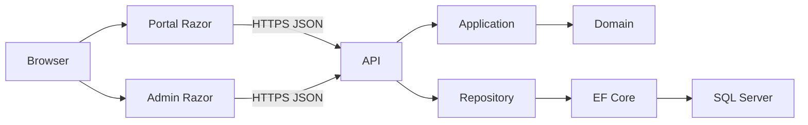

# PORTAL — SYSTEM UNDERSTANDING DOCUMENT

تاریخ: 2026-09-16 — نسخه 1، سند شناخت برای بازبینی؛ مجوز Implementation نیست.

## 0. دامنه، مبنا و روش شواهد

این سند دو وضعیت را جدا می‌کند: **B0** بررسی مستقیم 2026-09-13 روی OI، commit `75abbe3c801f7cd69e847a759c1b9aebb6782824`؛ **B1** فایل‌های کاری خوانده‌شده در 2026-09-16، HEAD آغاز بررسی `44725fb` به‌علاوه تغییرات ثبت‌نشده سایر تسک‌ها. B1 یک release ثابت نیست. تغییرات احراز هویت، دیتابیس و منوها هم‌زمان ادامه دارند؛ مطالب این سند درباره نسخه خوانده‌شده‌اند، نه تضمین آخرین وضعیت پس از تحویل.

**Confirmed** یعنی در کد/فایل/گفت‌وگوی بررسی‌شده دیده شده؛ وجود فایل، اجرای موفق در Production را اثبات نمی‌کند. **Intended** یعنی تصمیم یا نیاز ثبت‌شده، نه قابلیت کامل. **Unknown — نیازمند تصمیم یا بررسی بیشتر** برای موارد بدون شاهد کافی. وضعیت اجرایی جداگانه با Implemented، Partially Implemented، Planned، Not Found و Unknown بیان شده است. Suggested پیشنهاد این تحلیل است و تصمیم مصوب نیست.

منابع اصلی: `CLAUDE.md`، `README.md`، `docs/five-project-architecture.md`، `docs/organizational-publications.md`، `docs/ui-phase-0.md`، `docs/portal-requirements-task-02.md`، Solution و Projectها، Programها، Domain، Application، Controllerها، Repositoryها، shared/UI و Contracts، PageModelها و Razor، تنظیمات، SQL و تست‌ها. مکالمه «راهنمای دریافت branch OI» و وضعیت/تاریخچه کار منوها نیز بررسی شد. تمام تاریخچه بیرون از مکالمات در دسترس ادعا نمی‌شود.

در B0، فهرست 724 فایل غیرتولیدی قابل جست‌وجو شامل 29 فایل C# و 20 Razor بود. کد کاربردی بررسی شد؛ صدها asset قالب/کتابخانه، فونت و تصویر به معنی صدها قابلیت محصول نیستند. ممیزی خط‌به‌خط تمام کتابخانه‌های ثالث، فایل‌های باینری و داده Production انجام نشده است. فایل مستقل diagram شامل YARP/CDC پیدا نشد؛ نمودار متنی CLAUDE و مفاهیم پرامپت منابع معماری هدف هستند. Coverage این سند شناخت معماری و مسیرهای کاربردی است؛ ممیزی جامع امنیت یا گواهی ASVS نیست.

## 1. Executive Summary

Portal نقطه ورود سازمانی برای پرسنل و مدیران است؛ مسئول هویت و دسترسی مرکزی، تجربه مشترک، فهرست سامانه‌ها و اطلاع‌رسانی است. منطق کسب‌وکار HR، AccessReport و سامانه‌های دیگر باید نزد همان سامانه‌ها بماند. این مرز در CLAUDE تصریح شده است.

در B0 یک برنامه Razor Pages با EF مستقیم در PageModel بود. در B1 پنج پروژه محصول، سه میزبان اجرایی Portal/Admin/API و دو کتابخانه Domain/Application وجود دارد. UIها API را از سمت سرور فراخوانی می‌کنند. داده کاربران، نقش‌ها، مجوزها و سامانه‌ها مدیریت می‌شود؛ انتشار خبر/اطلاعیه/بخشنامه افزوده شده است. کارت‌های سامانه و اعلان شخصی هنوز داده نمونه‌اند. YARP، Event Bus، SignalR و CDC پیاده‌سازی تأییدشده ندارند.

مهم‌ترین مسئله باقی‌مانده در نسخه احراز هویت خوانده‌شده، بازیابی رمز با اطلاعات ثابت و فعال‌سازی حساب فاقد رمز در اولین ورود است. پروژه احراز هویت در حال تغییر است؛ رفع این موارد فقط پس از مشاهده نسخه نهایی و آزمون قابل اعلام است.

## 2. هدف و فلسفه Portal

Confirmed/Intended: Central Intranet Portal، مدیریت Users/Roles/Permissions/Applications، Dashboard، Navigation و اطلاع‌رسانی. Application Launcher واقعی و SSO سامانه‌های بیرونی Intended هستند. API فعلی، API خود Portal است؛ وجود آن به معنی API Gateway نیست. Integration Platform در چشم‌انداز مطرح است ولی اتصال واقعی سازمانی هنوز اثبات نشده است. Portal نباید مالک دیتابیس یا منطق داخلی تمام سامانه‌ها شود.

## 3. Architectural Vision

هدف نزدیک ثبت‌شده: معماری لایه‌ای پنج‌پروژه‌ای و API مرکزی، UI مستقل از DAL، حفظ مسیرهای موجود و عدم تبدیل بی‌دلیل به Microservice. هدف گسترده پرامپت: IdP، Gateway، Adapter/Facade، ارتباط رویدادی، اعلان بلادرنگ و observability؛ انتخاب محصول، توپولوژی و ترتیب الزام‌آور آن‌ها Unknown است. وجود RabbitMQ و Kafka در فهرست به معنی الزام استفاده هم‌زمان نیست.

## 4. Current Architecture

B1: Browser → Razor UI → ApiClient/HTTPS → Controller → Application Service → Repository → EF Core → SQL Server.

Portal و Admin Cookie مشترک محافظت‌شده دارند. API از Bearer Token محافظت‌شده ASP.NET Core و کلید کلاینت سروری استفاده می‌کند؛ JWT/OIDC عمومی نیست. Application به Domain وابسته است؛ API پیاده‌سازی زیرساخت را نگه می‌دارد. پوشه shared با Compile Link مصرف می‌شود، پروژه مستقل نیست. نسخه قدیمی در ریشه برای مقایسه مانده و از Solution فعال خارج است.

## 5. Current vs Target

| حوزه | Current B1 | Target/Intended | Gap |
|---|---|---|---|
| Identity | کاربران محلی و PasswordHasher | هویت یکپارچه سازمانی | IdP/LDAP نهایی و منبع هویت |
| Authentication | Cookie UI + opaque Bearer API | ورود سازمانی و 2FA | کار هم‌زمان؛ تأیید نهایی نشده |
| Authorization | ADMIN در UI/API؛ Permission infrastructure | مجوز دقیق سامانه‌ای | rollout امن، freshness و scope |
| Gateway | API کاربردی؛ YARP Not Found | YARP در چشم‌انداز | تمام route/cluster/trust design |
| Frontend | دو Razor host | تجربه مرکزی داده واقعی | کارت‌ها/اعلان‌ها mock |
| Backend | Application/Repository/EF | حفظ مرزها | سرویس عمومی بزرگ و فهرست‌های بدون paging |
| Integration | HTTP داخلی UI→API | اتصال API سامانه‌ها | قرارداد، هویت و adapter |
| Event Bus | Not Found | Planned در چشم‌انداز | انتخاب broker و delivery semantics |
| Notification | Entity و UI نمونه | اعلان واقعی و SignalR | ingestion، recipient، read، realtime |
| CDC/Analytics | Not Found | اکوسیستم داده | مالکیت و نیاز کسب‌وکار |
| Logging | ILogger و رویداد محدود انتشار/خطا | audit و تجمیع | پوشش، retention، correlation |
| Monitoring | health/metrics/tracing یافت نشد | observability | SLO، alert و زیرساخت |
| Security | کنترل‌های پایه و ریسک‌های باز | hardening مبتنی بر تهدید | recovery/session/dependency/network |

## 6. Solution Structure

```text
OrganizationIntranet.sln
  src/OrganizationIntranet.Domain       Class Library net8.0
  src/OrganizationIntranet.Application  Class Library net8.0 → Domain
  src/OrganizationIntranet.Api          Web API net8.0 → Application
  src/OrganizationIntranet.Portal       Razor Pages net8.0
  src/OrganizationIntranet.Admin        Razor Pages net8.0
shared/Contracts                       DTOهای Compile Link
shared/UI                              ApiClient، UiHost، ApiPageExceptionFilter
wwwroot                                asset مشترک کپی‌شونده در build/publish
 tests/OrganizationIntranet.SmokeTests  خارج از Solution محصول
 database/، tools/sql/                  اسکریپت‌های تغییر/بررسی داده
```

Domain: Entity و ارتباطات. Application: IntranetService، PublicationService و abstractionهای repository/password. API: Controllerها، DI، EF، security، Swagger. Portal: Account، Portal، Publications. Admin: Account، Admin/Users/Roles/Applications/Permissions/Publications. UIها ProjectReference به DAL ندارند. کلاس‌های shared/Contracts مستقل از navigation graph و PasswordHash هستند. بسته‌های مستقیم: DNTCaptcha.Core 5.3.4 در UI؛ EF Core SqlServer/Design 8.0.10 و Swashbuckle.AspNetCore 6.6.2 در API، مطابق csproj خوانده‌شده.

## 7. Technologies & Frameworks

Actual: .NET/ASP.NET Core 8، C#، Razor Pages، Web API Controllers، EF Core، SQL Server provider، Bootstrap RTL/yzen، JavaScript/jQuery، DNTCaptcha، ASP.NET Core Data Protection، Cookie و opaque Bearer، HttpClient، Swagger توسعه. SDK مشاهده‌شده در B0 برابر 9.0.101 بود؛ TargetFramework همچنان net8.0 است.

Planned در چشم‌انداز: YARP، IdP/OIDC، broker، SignalR/Redis، CDC/Debezium، analytics و logging/monitoring مرکزی. React، Angular، Blazor، EF6، gRPC، SAML، Kubernetes و Docker در اجرای بررسی‌شده Not Found؛ انتخاب آینده Unknown. وجود Azure.Identity/Microsoft.Identity.Client به‌صورت transitive شاهد استفاده از Entra ID نیست. فایل‌های chart و two-step-verification قالب شاهد BI یا MFA نیستند.

## 8. Frontend Architecture

Razor سمت سرور با PageModel و DTO. Account از LayoutAuth، Portal از LayoutApp سبک و Admin از LayoutAdmin استفاده می‌کند. مسیرها مبتنی بر Razor file routing هستند. Query/Form/TempData و Cookie state سرور را حمل می‌کنند؛ theme در localStorage نگه‌داری می‌شود. Access/Refresh Token در localStorage نیستند.

Ajax حساب به Page handler هم‌مبدأ POST می‌کند؛ PageModel با ApiClient به API می‌رود. خطای API با ApiException/ApiPageExceptionFilter به خروج، 403، 404 یا Error تبدیل می‌شود. Toast از textContent استفاده می‌کند. Portal هنوز آرایه‌های allSystems/notifications دارد. UI انتشار داده واقعی را از API می‌گیرد. فونت Google Fonts در Portal یک وابستگی اینترنتی است. اصلاح منو، ReturnUrl محلی، پروفایل و responsive در تسک منو در جریان است؛ این سند تأیید بصری آن نیست.

## 9. Backend Architecture

Controllerهای Account/Admin/Publications درخواست‌ها را به Service می‌دهند؛ API مسئول auth، status و DI است. IntranetService اعتبارسنجی طول/ضرورت، انتخاب نقش معتبر، URL HTTP(S)، hash و orchestration را انجام می‌دهد. Repositoryهای API EF را پنهان می‌کنند. SaveUser جدید در B1 یک SaveChanges برای کاربر و نقش‌ها دارد؛ ریسک دو ذخیره مستقل B0 دیگر نباید به‌عنوان وضعیت B1 گزارش شود.

Mapping دستی است؛ AutoMapper/Mediator/CQRS یافت نشد. DbContext واحد دارد و نگاشت Fluent در OnModelCreating است. فهرست Users/Roles/Applications عمدتاً کامل بارگذاری و در حافظه پردازش می‌شود؛ Publication paging دیتابیسی 20تایی دارد. API استثناهای اعتبارسنجی/رکورد ناموجود/DB را به 400/404/409 تبدیل می‌کند و سایر خطاها پیام عمومی 500 دارند.

## 10. Authentication

نسخه خوانده‌شده: CAPTCHA در UI → API login همراه X-Intranet-Client → اعتبارسنجی کاربر فعال و PasswordHasher → صدور opaque access/refresh → me → Cookie UI. RememberMe ماندگاری مرورگر را تعیین می‌کند. API عمر 14 روز برای access/refresh تنظیم کرده است. UI هنگام گذشت نیمه عمر، refresh می‌کند و در شکست تمدید خارج می‌شود.

Claims نقش/مجوز snapshot هستند. refresh در AccountController همان principal قبلی را تمدید می‌کند؛ بررسی مجدد فعال‌بودن کاربر/نقش مشاهده نشد. Logout Cookie را حذف می‌کند، revocation توکن API و logout سامانه‌های بیرونی اثبات نشده است. ForgotPassword هنوز مقایسه Username/NationalId/MobileNumber و تنظیم رمز است. PasswordHash خالی در Login به رمز ورودی تبدیل می‌شود. حداقل استحکام رمز/lockout حساب و MFA در این مسیر خوانده‌شده موجود نیست.

در حین بررسی، فایل‌های AuthenticationContracts و IAuthenticationInfrastructure برای LDAP/2FA ظاهر شدند. وضعیت این بخش **Partially Implemented / in progress** است؛ وجود قراردادها اتصال LDAP یا ارسال OTP موفق را اثبات نمی‌کند. یافته‌های امنیتی بالا baseline قبل از تکمیل همان کار هستند.

## 11. Authorization

API مدیریت و UI مدیریت ADMIN را enforce می‌کنند؛ API fallback authenticated دارد. Publication عمومی نیز نیازمند ورود است و پیش‌نویس توسط query سرور مخفی می‌شود. PermissionPolicyProvider و Handler موجودند، ولی Admin هنوز بر Role تکیه دارد. UserPermission در مسیر اعطای Claims استفاده نمی‌شود.

Claims فقط PermissionCode دارند. در B0 یکتایی فقط ApplicationId+Code بود و برخورد کد بین سامانه‌ها ریسک داشت؛ EF خوانده‌شده B1 یکتایی سراسری Code نیز اضافه کرده است. تطابق DB نهایی با این قید باید پس از پایان کار دیتابیس تأیید شود. RequireAuthenticatedUser صریح در policy پویا و semantics scope نیازمند بازبینی مستقل است. Application.IsActive/Role.IsActive در ساخت profile خوانده‌شده فیلتر نشده‌اند. مخفی‌کردن کارت سرور authorization نیست.

## 12. Identity

User، Role، UserRole، Permission، RolePermission، UserPermission و Application وجود دارند. Org/Department/Group و membership سازمانی در baseline مدل خوانده‌شده وجود ندارد. NationalId/Mobile/Email اطلاعات هویتی‌اند؛ تأیید مالکیت موبایل با ذخیره آن اثبات نمی‌شود. نگاشت حساب محلی به directory، شناسه immutable و lifecycle منابع انسانی Unknown است.

## 13. YARP / API Gateway

YARP package، AddReverseProxy، routes، clusters، destinations و transforms در baseline یافت نشد. پس Gateway فعلی Implemented نیست و ApiClient نیز reverse proxy عمومی نیست. برای headers/claims forwarding، timeout/retry/circuit breaker، rate policy، correlation و upstream TLS هیچ تنظیم YARP قابل گزارش نیست. HttpClient داخلی timeout 30 ثانیه دارد و redirect/cookie forwarding خودکار خاموش است؛ این ویژگی را نباید به YARP نسبت داد.

## 14. Application Integration

| نام | شاهد | وضعیت اتصال |
|---|---|---|
| AccessReport و HR | نمودار CLAUDE | Intended؛ endpoint/stack/auth/DB Unknown |
| فیش حقوق، حضورغیاب، فرزین، درگاه واحد، مبین، مشتریان | allSystems | Mock؛ لینک # |
| استعلام سند، ورود/اشتراک فایل، آرشیو، وظایف، دیماند | همان آرایه | Mock با hasAccess=false |

برای تمام سامانه‌های بیرونی بالا protocol عملیاتی، API contract، database، adapter، facade، event و dependency معتبر در این repository یافت نشد. نام «مدیریت وظایف» اتصال به مخزن دیگری را اثبات نمی‌کند. Application registry قابلیت ذخیره metadata دارد ولی launcher هنوز آن را مصرف نمی‌کند.

## 15. Legacy Applications

وجود کد ASP.NET قدیمی، EF6، SOAP یا adapter در Portal اثبات نشد. Suggested: برای سامانه legacy ابتدا قابلیت API/SSO واقعی آن مشخص شود، سپس adapter/facade با مالکیت روشن قرارداد ایجاد شود. دسترسی مستقیم Portal به دیتابیس business سامانه‌ها با قاعده ارتباط API در CLAUDE همسو نیست؛ تغییر این قاعده تصمیم مستقل می‌خواهد.

## 16. Integration Architecture

Actual: HTTP JSON بین UI و API، DTOهای shared و کلید سروری. REST عمومی سامانه‌های بیرونی، gRPC، webhook، scheduled job و command/event integration یافت نشد. قراردادهای publication و account داخلی‌اند. Timeout مشخص است؛ retry خودکار write و idempotency key مشاهده نشد. پیش از افزودن retry برای POST باید semantics تکرار تعیین شود.

## 17. Event Bus

RabbitMQ، Kafka، MassTransit، producer/consumer و contract رویداد در baseline Not Found؛ در پرامپت Planned هستند. DLQ، retry، idempotency، ordering، correlation و versioning Unknown هستند چون مسیر رویدادی پیاده نشده است. هیچ تضمین exactly-once یا eventual consistency فعلی ادعا نمی‌شود.

## 18. Notification / SignalR

Notification و UserNotification دارای recipient/read state و ApplicationId هستند؛ ingestion و ارسال واقعی/Hub یافت نشد. all-read روی آرایه مرورگر است و ذخیره DB ندارد. Redis backplane، connection management و user mapping SignalR یافت نشد. Publication خبر عمومی سازمانی است و جایگزین اعلان شخصی/رویداد سامانه بیرونی نیست.

## 19. CDC / Data / Analytics

SQL Server دیتابیس تراکنشی Portal است. مدل Sec/App/Notify با 9 موجودیت اولیه و Publication افزوده‌شده دیده شد. CDC، Debezium، Kafka topics، warehouse، ClickHouse، Metabase و Power BI در baseline Not Found. Analytics هدف اکوسیستم است؛ مسئولیت مستقیم Portal از شواهد ثابت نمی‌شود. اسکریپت‌های database و tools/sql اکنون وجود دارند؛ وجودشان اجرای آن‌ها را اثبات نمی‌کند.

## 20. Logging

ILogger داخلی، پیام خطای عمومی همراه TraceIdentifier و ثبت save publication با UserId/PublicationId موجودند. Serilog/ELK/Loki یافت نشد. Error UI RequestId را نشان می‌دهد. پوشش audit ورود، تغییر نقش، بازیابی و خواندن داده کامل نیست. عبارت UI «تمامی فعالیت‌ها ثبت می‌شود» با audit کامل تأیید نشده است. UserId/TraceId در چند پیام به معنی correlation سراسری UI→API نیست.

## 21. Monitoring / Observability

AddHealthChecks، OpenTelemetry، Prometheus، Grafana و alert configuration یافت نشد. Swagger ابزار توسعه است، health check نیست. وضعیت uptime، backup restore، SLO، RPO/RTO و tracing Production Unknown است.

## 22. Multi-Application

Registry شامل نام، کد، BaseUrl، توضیح، Icon، DisplayOrder و IsActive است. Permission.ApplicationId موجود است؛ Roleها global هستند. organization access، app-specific MFA، health و visibility مبتنی بر داده واقعی هنوز تأیید نشده‌اند. محدودیت کد سراسری Permission باید در قرارداد onboarding سامانه‌ها مستند شود.

## 23. Intranet Requirements

UI فارسی/RTL و برند سازمانی Confirmed است؛ LAN-only بودن Admin با داشتن نقش ADMIN ثابت نمی‌شود. تنظیم توصیه‌شده سند پنج‌پروژه‌ای محدودسازی API به سرورهای UI است؛ اجرای firewall/DMZ/segmentation Unknown است. Sites:Portal/Admin و API HTTPS لازم‌اند. اشتراک Cookie نیازمند دامنه/کلید مشترک است و روی دامنه‌های نامرتبط راه‌حل SSO محسوب نمی‌شود. فونت بیرونی و بازیابی بسته‌ها باید در طراحی محیط جدا از اینترنت لحاظ شوند.

## 24. Security Architecture

کنترل‌های موجود: PasswordHasher، Cookie امن HttpOnly/SameSite Lax، Data Protection، server authorization، CAPTCHA، antiforgery، HTML encoding، LINQ، کلید API با مقایسه fixed-time، HTTPS، پیام عمومی خطا و rate limiter حساب. Key UI در فایل‌سیستم persist می‌شود؛ ACL/encryption-at-rest و API key ring عملیاتی Unknown است. نسبت‌دادن این کنترل‌ها به گواهی OWASP یا Zero Trust صحیح نیست.

## 25. OWASP Gap Analysis

| حوزه | وضعیت و شاهد | ریسک | پیشنهاد، بدون اجرا |
|---|---|---|---|
| Recovery | اطلاعات ثابت در IntranetService | Critical مشروط به دسترسی مهاجم به اطلاعات | اثبات مالکیت با token یک‌بارمصرف و expiry |
| First login | ثبت رمز برای hash خالی | Critical برای حساب‌های واجد شرط | enrollment کنترل‌شده |
| Session | تمدید snapshot، revocation یافت نشد | High؛ دوام دسترسی لغوشده | سیاست ابطال/بازاعتبارسنجی |
| Authorization | ADMIN و عدم فیلتر نقش فعال در profile | High | اعمال قرارداد فعال‌بودن و تست |
| CSRF | antiforgery POST، Logout GET | Medium؛ logout اجباری | بررسی خروج POST |
| XSS | Razor/textContent؛ innerHTML روی mock | کنترل پایه؛ داده واقعی آینده حساس | encoding زمینه‌ای و CSP |
| SQL Injection | EF LINQ؛ SQL عملیاتی جدا | مسیر تزریق در کد خوانده‌شده مشاهده نشد | حفظ پارامتری‌سازی، ممیزی scripts |
| SSRF | BaseUrl فقط metadata؛ client مقصد ثابت | SSRF فعلی اثبات نشد | allowlist هنگام اتصال واقعی |
| CORS | browser→API مستقیم طراحی نشده | تنظیم production Unknown | کمینه‌سازی originها در صورت نیاز |
| Headers/TLS | HTTPS/HSTS؛ CSP صریح یافت نشد | Medium | بررسی reverse proxy و header نهایی |
| Rate limit | 30/min بر IP API | High ظرفیت مشترک UI | کلیدگذاری مناسب user/client، بدون اعتماد کور به forwarded IP |
| Secrets | key اجباری و عدم نمایش به browser | key مشترک نقطه اعتماد مهم | rotation، ACL و persistence |
| Audit | رویدادهای محدود | High | actor/action/result/correlation و retention |
| Dependencies | B0 پنج هشدار NuGet | نیازمند triage نسخه نهایی | اسکن تازه و ارتقای آزموده |
| Data isolation | self profile و draft filter | کنترل جزئی | تست horizontal access در قابلیت‌های بعدی |

این جدول gap review است، نه ارزیابی کامل همه requirements ASVS. منابع روش: [OWASP ASVS](https://owasp.org/www-project-application-security-verification-standard/)، [Forgot Password](https://cheatsheetseries.owasp.org/cheatsheets/Forgot_Password_Cheat_Sheet.html)، [Session Management](https://cheatsheetseries.owasp.org/cheatsheets/Session_Management_Cheat_Sheet.html). پیشنهاد recovery از راهنمای OWASP برای token امن/یک‌بارمصرف و پیشنهاد session از لزوم مدیریت چرخه عمر نشست استفاده می‌کند.

## 26. Design Patterns

Actual: layered architecture، DI، Repository، DbContext/SaveChanges به‌عنوان مرز unit-of-work، manual mapping، policy provider/handler. Clean/Onion کامل ادعا نمی‌شود؛ Infrastructure در API قرار دارد و پروژه جدا نیست. Intended: Adapter/Facade، Gateway و Event-driven. Suggested: تفکیک تدریجی IntranetService بر اساس مسئولیت فقط در تغییر مصوب؛ CQRS/Mediator/Decorator/Factory سفارشی الزام فعلی ندارند.

## 27. Coding Conventions

PascalCase برای type/member و I برای interface؛ Async suffix؛ DTO/Request/Result records در shared/Contracts؛ Entity در Domain/Entities؛ EF/Repository در Api/Data؛ کد UI در PageModel، CSS/JS بخشی inline. namespaceهای برخی UI همچنان OrganizationIntranet.Pages هستند؛ با assembly جدا الزاماً تعارض نیست. زمان اکثر مسیرها UTC و نمایش شمسی با Helper است. mapping و validation دستی‌اند؛ Publication DataAnnotations هم دارد. XML docs محدود و comments فارسی/انگلیسی‌اند. DB سه schema و نام FK/index صریح دارد؛ استاندارد جدید نام‌ها در کار دیتابیس در حال تثبیت است.

## 28. Architecture Decisions

| Decision | Reason | Status | Affected | Alternative considered | Consequence |
|---|---|---|---|---|---|
| منطق سامانه‌ها بیرون Portal | استقلال business | Intended الزام CLAUDE | integration | Unknown | API مرز اتصال |
| پنج پروژه و API مرکزی | جداسازی UI/DAL | Confirmed در سند و کد | کل solution | monolith قبلی | سه host و نیاز عملیات بیشتر |
| shared Compile Link | پنج پروژه محصول | Confirmed | Contracts/UI | پروژه ششم | هماهنگی تغییر قرارداد |
| claims در login | کارایی و الگوی قبلی | Confirmed | session/auth | query هر درخواست | stale permission |
| حفظ ADMIN تا seed | جلوگیری از lockout مدیر | Intended/محفوظ | Admin | سوییچ فوری | policy rollout بعدی |
| UserPermission حذف نشود | وابستگی نامعلوم | Intended | schema | حذف | تصمیم lifecycle باقی |
| Portal واحد | لغو تفکیک اینترنت/اینترانت در سند | مستند؛ کد یک Portal | deployment | دو Portal | topology هنوز نیازمند تأیید |

## 29. Completed Work

شاهد کد: پنج پروژه، جداسازی HTTP UI، CRUD اصلی مدیریت، Cookie/Bearer، CAPTCHA، policy infrastructure، publication با draft/publish و فیلتر سرور، اسکریپت SQL و تست‌های یکپارچه. تنظیم هزارگان CAPTCHA خاموش است. «کامل» در این بخش یعنی وجود implementation مسیر ذکرشده، نه تأیید Production. فاز صفر و منوها دارای بررسی مستقل‌اند.

## 30. Remaining Work

| Priority | Description | Reason | Dependency | Risk | Phase |
|---|---|---|---|---|---|
| Critical | تأیید recovery/enrollment جدید | baseline ناامن | کار authentication | تصاحب حساب | 1 |
| High | ابطال دسترسی/نقش غیرفعال | snapshot تمدیدشونده | session policy | دسترسی ماندگار | 1 |
| High | baseline نهایی DB و deployment | schema در تغییر | کار database/publication | شکست runtime | 0–1 |
| High | launcher واقعی و کنترل سرور | mock فعلی | registry/permission contract | وعده UI نادرست | 2 |
| High | audit و dependency triage | پوشش ناکافی | نسخه تثبیت‌شده | کشف‌نشدن رخداد | 1 |
| Medium | نخستین integration | هدف platform | API/IdP مالک سامانه | ناسازگاری | 3 |
| Medium | notification واقعی | UI نمونه | recipient/event contract | حریم خصوصی | 4 |
| Medium | UI offline و acceptance | intranet | کار فاز صفر/منو | usability | 0–2 |
| Low | cleanup assets و یکنواختی docs | بدهی نگهداری | usage inventory | regression | 5 |

## 31. Constraints

نسخه root تاریخی است؛ اصلاح نسخه جدید در src انجام می‌شود. قرارداد پنج پروژه، Razor، API-only UI، حفظ schema/routeها مگر تصمیم جدید، مستقل‌ماندن business و حفظ authorization الزامی‌اند. migration باید دارای بررسی وابستگی و rollback باشد. تغییرات هم‌زمان سایر تسک‌ها متعلق به این تحلیل نیستند و نباید بازنویسی شوند.

## 32. DO NOT CHANGE

این تسک بدون تأیید صریح کاربر هیچ refactor، rename/delete/move، package/framework/reference/namespace، API/database، authentication/authorization، YARP یا deployment/security configuration انجام نمی‌دهد. این سند تصمیم‌های تازه سایر تسک‌ها را لغو نمی‌کند؛ هر تغییر آن‌ها باید از مجوز و گزارش همان تسک پیگیری شود. تأیید سند به‌تنهایی تأیید همه پیشنهادهای Implementation نیست.

## 33. Risks

امنیت: recovery، hash خالی، stale claims. Availability: API/SQL نقاط مرکزی، key ring و دسترس‌پذیری شبکه. Performance: بارگیری کامل لیست و graph، حجم Cookie همراه tokenها. Integration: تصور اشتباه SSO و mock access. Data consistency: تقدم اجرای scripts و هماهنگی model با DB؛ سه host نیازمند قرارداد deploy سازگار. Network: key مشترک به‌تنهایی segmentation نیست. Operational complexity: اضافه‌شدن broker/CDC پیش از تثبیت پایه هزینه بالا دارد. eventual consistency فعلاً مسیر پیاده‌شده ندارد.

## 34. Technical Debt

| Problem | Impact | Severity/Priority | Suggested resolution |
|---|---|---|---|
| اسناد B0 کنار کد B1 | تحلیل/ویرایش فایل اشتباه | High | versioned baseline و نشان‌دادن source فعال |
| IntranetService چندمسئولیتی | تغییر و تست دشوار | Medium | تفکیک مصوب بر use case |
| فهرست کامل کاربران | memory/latency | Medium | paging/filter DB |
| Cookie حاوی چند token/claim | اندازه و محدودیت header | Medium | اندازه‌گیری و تصمیم session store |
| زمان UTC/local تاریخی | خطای نمایش/مهاجرت | Medium | mapping نهایی و تست timezone |
| UI ادعای SSO/audit | برداشت غلط قابلیت | High | تطبیق متن با capability |
| assets نمونه قالب | سطح نگهداری/وابستگی | Low | inventory پیش از حذف |

## 35. Roadmap پیشنهادی

0. بستن baseline پنج‌پروژه‌ای، گزارش کارهای موازی و acceptance باقی‌مانده.
1. تکمیل/آزمون identity و session، صحت DB/rollback، audit پایه و dependencies؛ امنیت به انتهای roadmap موکول نشود.
2. permission rollout امن، registry→launcher واقعی و UX صادقانه.
3. اتصال یک سامانه واقعی به‌عنوان pilot؛ IdP/Gateway/adapter صرفاً طبق نیاز اثبات‌شده.
4. اعلان پایدار و سپس realtime/event bus با delivery contract.
5. observability و production hardening در تمام مراحل، تکمیل ظرفیت/DR.
6. analytics/CDC پس از تعیین مالک داده، نیاز BI و ظرفیت عملیاتی.

## 36. Dependency Map



این نمودار compile و runtime را برای توضیح کنار هم دارد: Application abstraction را می‌شناسد و implementation Repository با DI از API تزریق می‌شود. Target جدا: Browser→Portal/IdP؛ Portal/Gateway→External App؛ App→Bus→Notification→SignalR→Browser؛ App→CDC→Warehouse→BI. هیچ‌یک از پیکان‌های target شاهد اتصال فعلی نیست.

## 37. Request / Data Flows

Current Login: Browser form+antiforgery→UI captcha→API client key→AccountController→Service→Repository/User→opaque tokens→UI me→protected Cookie→redirect محلی یا host مصوب.

Current API: Cookie→ApiClient access token+client key→API authorization→service→EF→DTO→Razor/Ajax. CRUD DB در UI نیست.

Current Publication: Admin form→API ADMIN→validate→save UTC/actor→SQL→Portal published query→encoded content. پیش‌نویس در API عمومی 404 می‌دهد.

Current Logout: Cookie signout؛ خروج SSO بیرونی تأیید نمی‌شود. Current Notification mark-read: تغییر memory JavaScript؛ بدون persisted event. Event و Analytics: فقط مسیرهای target بخش 36.

## 38. Critical Unknowns

| ID | Evidence missing | Why it matters | Question to resolve |
|---|---|---|---|
| U001 | deployment/DB نهایی | current runtime | کدام نسخه و migration در محیط هدف اجراست؟ |
| U002 | فایل diagram اصلی | ارجاع target | diagram مصوب کجاست و نسخه آن چیست؟ |
| U003 | خروجی نهایی auth | خطر baseline | LDAP/2FA/recovery چه آزمون و قرارداد نهایی دارد؟ |
| U004 | قرارداد سامانه‌های بیرونی | integration | مالک، API، protocol و auth هر سامانه چیست؟ |
| U005 | topology و ACL | intranet security | DMZ، firewall و دامنه‌ها چگونه‌اند؟ |
| U006 | key ring/rotation | session availability | کلیدهای UI/API چگونه محافظت و بازیابی می‌شوند؟ |
| U007 | SLA و حجم کاربران | capacity | concurrency، RPO/RTO و SLO چیست؟ |
| U008 | schema فعلی و audit اجرای SQL | consistency | کدام up/down واقعاً اجرا و verify شده است؟ |
| U009 | تست بصری/آفلاین نهایی | UI acceptance | نتایج فاز صفر و منو در نسخه نهایی چیست؟ |
| U010 | decision broker/BI | هزینه معماری | use case و مالک Event/CDC چه کسی است؟ |

تمام موارد بالا: Unknown — نیازمند تصمیم یا بررسی بیشتر.

## 39. Contradictions

C001: سند قدیمی «Razor خالص بدون controller» در برابر Web API جدید؛ تحول معماری مستند است، regression خودکار نیست. سند پنج‌پروژه‌ای مقدم است.

C002: UI «ورود بدون login مجدد» و «خروج همه سامانه‌ها» در برابر mock cards و Cookie داخلی؛ SSO بیرونی تأیید نمی‌شود.

C003: CLAUDE قدیمی نقش‌های فعال را ذکر می‌کند، profile/login خوانده‌شده فیلتر Role.IsActive ندارد؛ نیازمند تصمیم/اصلاح در کار auth.

C004: UI «تمامی فعالیت‌ها ثبت می‌شود» ولی audit فقط محدود است.

C005: سند مهاجرت می‌گوید DB mapping حفظ شده؛ B1 EF در کار دیتابیس نام index، UTC، NoAction و read-state constraint را تغییر داده؛ snapshotها متفاوت‌اند و باید سند DB نهایی مرجع شود.

C006: مستند publication موفقیت 18 تست و مستند اولیه پنج‌پروژه‌ای 8 تست را گزارش می‌کنند؛ این‌ها زمان/دامنه متفاوت‌اند، عدد فعلی اجراشده توسط این تحلیل نیستند. هشدار صفر در گزارش اولیه و پنج warning در گزارش بعدی نیازمند گزارش build نهایی هم‌نسخه است.

## 40. My Current Understanding of Portal

Portal پوسته سازمانی و محل مدیریت دسترسی و اطلاع‌رسانی است. اکنون دو UI دارد که خودشان پایگاه داده را نمی‌شناسند و از API واحد خدمت می‌گیرند. API کاربران، نقش‌ها، registry و محتوای سازمانی را با منطق Application و ذخیره‌سازی EF اداره می‌کند. هویت بین این دو UI به اشتراک گذاشته می‌شود، اما این اشتراک را نمی‌توان به همه نرم‌افزارهای سازمان تعمیم داد. بیشتر تجربه launcher و اعلان بین‌سامانه‌ای هنوز نمایش آینده است. مسیر درست رشد، تبدیل این نمایش به قراردادهای واقعی همراه با کنترل دسترسی و عملیات قابل پایش است؛ نه انتقال business تمام سامانه‌ها به Portal.

## 41. Confidence Level

| بخش‌ها | Confidence | علت |
|---|---|---|
| 1–9، 26–29، 36–37 | High برای کد خوانده‌شده | Solution/کلاس‌ها/مسیرها مستقیماً بررسی شده |
| 10–12، 19، 24–25 | Medium | شواهد قوی baseline ولی auth/DB هم‌زمان تغییر می‌کند |
| 13–18، 20–23 | High برای وجود/عدم وجود در baseline، Low برای Production | محیط و سرویس‌های بیرونی بررسی نشده |
| 3، 5، 30–35 | Medium | ترکیب تصمیم مستند و پیشنهاد مشروط |
| 38–40 | Medium | مجهولات صریح و mental model محدود به دامنه |
| انطباق ASVS، امنیت Production و UI بصری | Low/Not verified | ممیزی و تست عملیاتی اجرا نشده |

## 42. Verification و ممنوعیت Implementation

B0 توسط این تسک: build --no-restore با OutputPath بیرون مخزن و UseAppHost=false موفق؛ صفر error و پنج warning NuGet برای Azure.Identity 1.10.3، Microsoft.Identity.Client 4.56.0 و System.Formats.Asn1 5.0.0. این نتیجه متعلق به 13 سپتامبر و monolith است، نه پنج پروژه فعلی. build فایل‌های تولیدی obj را ممکن است بازتولید کرده باشد؛ کد/تنظیمات/DB تغییر داده نشد.

B1 توسط این تسک: Solution دارای پنج پروژه تأیید شد؛ جست‌وجوی EF/DbContext/SqlConnection در سورس UI و shared/UI نتیجه نداشت. مسیر سرویس/Repository/Controller و auth فعلی خوانده شد. YARP/Event Bus/SignalR عملیاتی یافت نشد؛ قراردادهای تازه LDAP/2FA به‌عنوان کار در جریان ثبت شدند. build/test هم‌زمان سایر تسک‌ها تکرار نشد و عدد pass تازه به این تحلیل نسبت داده نمی‌شود.

پوشش موجود کار منو: تست‌های ReturnUrl محلی، menu routes/assets، render صفحات محافظت‌شده و login/profile/logout در PortalSmokeTests وجود دارند؛ تاریخچه کار منو یک اجرای موفق test را ثبت کرده، ولی ادامه کار هنوز active است. فاز صفر مالک پذیرش بصری 360/768/1440، keyboard/focus، theme، captcha و offline است. این سناریوها توسط این تحلیل دوباره اجرا نشده‌اند و تأییدنشده باقی می‌مانند؛ آزمون endpoint جایگزین visual نیست.

هیچ اتصال یا نوشتن SQL، migration، login عملیاتی، restart سرویس و تغییر source توسط این تسک در ادامه B1 انجام نشد. خروجی این تسک فقط همین سند است. کدهای در حال تغییر دیگران و نتایج SQLite/تست‌های قبلی گواهی Production محسوب نمی‌شوند.

## 43. خروجی و مرحله بعد

این سند A تا AJ پرامپت را در بخش‌های 1 تا 42 پوشش می‌دهد. یافته محوری: معماری فعلی پنج‌پروژه‌ای است، نه monolith B0 و نه enterprise gateway/event platform تکمیل‌شده. publication واقعی از notification mock جداست. recovery/session baseline ریسک بالا دارد و کار auth باید آن را با شواهد ببندد. نسخه DB، IdP، topology و integration هنوز نیازمند تثبیت‌اند. roadmap پیشنهادی در بخش 35 است.

وضعیت: تحلیل برای بازبینی ارائه شد؛ منتظر تأیید صریح کاربر برای هر Implementation مربوط به این تسک. به‌روزرسانی این سند پس از پایان کارهای هم‌زمان باید با diff و نتایج همان نسخه انجام شود.
